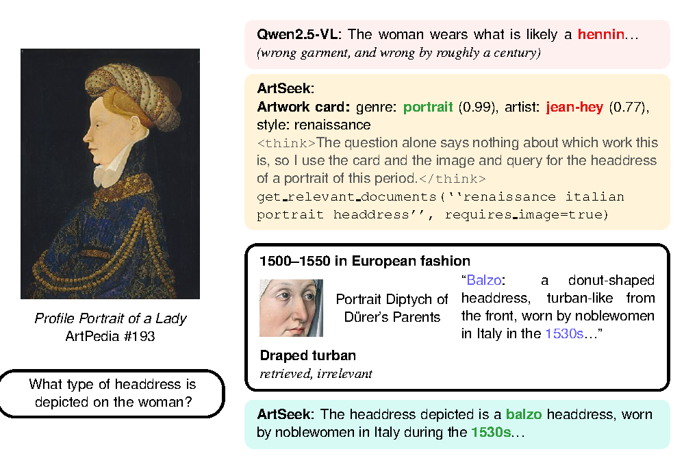

<div align="center">

# 🎨 ArtSeek

### Deep artwork understanding via multimodal in-context reasoning and late interaction retrieval

Nicola Fanelli · Gennaro Vessio · Giovanna Castellano<br>
University of Bari Aldo Moro

[](https://arxiv.org/abs/2507.21917)
[](https://huggingface.co/datasets/cilabuniba/wikifragments-visual-arts-embeds)
[](https://huggingface.co/cilabuniba/artseek-licn)
[](LICENSE)


</div>

ArtSeek answers open-ended questions about artworks. Given an image and a question, a multimodal LLM looks at the painting, reads an *artwork card* predicted by a classifier, decides when it needs external knowledge, and retrieves it from Wikipedia before answering. The language model is used zero-shot, and the repository includes an interactive demo.

## ✨ Highlights

- **WikiFragments**, a multimodal knowledge base: 8.2M fragments (a paragraph plus the images above it, rendered as one image) from 973k visual-arts pages of English Wikipedia, searched with ColQwen2 late interaction.
- **Two-stage retrieval** that keeps only the text tokens of a multimodal query and prefetches on pooled vectors, matching full multi-vector retrieval at under 7% of its cost.
- **LICN**, a late-interaction classifier for artist, genre, style, media and tags that beats prior work on ArtGraph and works over an open label set.
- **In-context tool calling**: a single worked example teaches Qwen2.5-VL-32B when and what to retrieve, over several steps.

## 🔍 How it works

<table>
<tr><td align="center">
<br>
<b>Multimodal retrieval.</b> The image and the question are encoded together by ColQwen2; only the question tokens are kept, candidates are prefetched on pooled fragment vectors and reranked on the full ones.
</td></tr>
<tr><td align="center">
<br>
<b>Late Interaction Classification Network.</b> Frozen ColQwen2 embeddings of the image and of every label, concatenated with learnable task embeddings, are encoded by a shared transformer and matched per task. The predictions form the <i>artwork card</i>.
</td></tr>
<tr><td align="center">
<br>
<b>In-context reasoning.</b> The one-shot example shown to the model: visual questions are answered directly, knowledge questions trigger <code>get_relevant_documents</code> calls whose fragments are read before answering.
</td></tr>
</table>

## 📊 Results at a glance

Question answering, mean correctness on a 0-2 scale judged by phi-4, with 95% confidence intervals (paper, Tab. 3). ArtSeek gains where its knowledge base covers the painting and ties with its backbone where it does not.

| Benchmark | KB coverage | Qwen2.5-VL-32B | ArtSeek | Δ [95% CI] |
|---|---|---|---|---|
| ArtPedia-VQA | 85.8% | 0.535 | **0.722** | **+0.186** [+0.119, +0.254] |
| LICNHeldOut | 53.3% | 1.010 | **1.197** | **+0.186** [+0.114, +0.257] |
| AQUA | 10.4% | 0.920 | 0.896 | −0.025 [−0.095, +0.046] |
| ArtCurate-AIC | 10.3% | 1.125 | 1.093 | −0.034 [−0.071, +0.003] |
| ArtQuest | 8.9% | 0.937 | 0.914 | −0.023 [−0.076, +0.031] |

The same gain holds with Gemma-3-27B and Mistral-Small-3.1-24B as backbones (+0.22 to +0.28 on ArtPedia-VQA). LICN reaches 71.8 / 78.5 / 69.8 top-1 on ArtGraph artist / genre / style. Captioning, retrieval and classification tables, with the commands to reproduce them, are in [`data/README.md`](data/README.md).

## 🖼️ Examples

<p align="center">
<br>
<em>The question names nothing to search for; the image and the card turn it into a query, and a retrieved fragment corrects the backbone's “hennin” into the right <b>balzo</b> (even though the card's artist is wrong).</em>
</p>

<p align="center">
<br>
<em>ArtSeek compared with Qwen2.5-VL and ChatGPT. Right: a failure case, where retrieval suggests a plausible but wrong battle.</em>
</p>

## 📑 Contents

1. [Requirements](#1-requirements)
2. [Installation](#2-installation)
3. [Download the resources](#3-download-the-resources)
4. [Build the vector store](#4-build-the-vector-store)
5. [Run the demo](#5-run-the-demo)
6. [Use ArtSeek from Python](#6-use-artseek-from-python)
7. [Reproduce the paper's evaluation](#7-reproduce-the-papers-evaluation)
8. [Rebuild the resources from scratch](#8-rebuild-the-resources-from-scratch)

The additional experiments of the revised paper (question-answering benchmarks, other backbones, human evaluation) are on the [`rebuttal`](https://github.com/cilabuniba/artseek/tree/rebuttal) branch.

---

## 1. Requirements

| | |
|---|---|
| GPU | one NVIDIA GPU with 64 GB (tested on A100 64 GB, CUDA 12.6). vLLM, ColQwen2 and LICN share it. |
| RAM | 128 GB |
| Disk | ~1 TB for the Hugging Face cache (WikiFragments is ~495 GB, downloaded and then prepared by `datasets`), ~310 GB for the Qdrant storage |
| OS | Linux, Python 3.12, [uv](https://docs.astral.sh/uv/) |

Setting everything up takes about a day, mostly unattended: downloading WikiFragments, ingesting it into Qdrant (~2.5 h with 4 processes) and building the index (~8 h).

## 2. Installation

```bash
git clone https://github.com/cilabuniba/artseek.git
cd artseek
uv sync                  # creates .venv with PyTorch 2.8 (CUDA 12.6) and vLLM 0.11
source .venv/bin/activate
cp .env.example .env     # then edit it
```

`.env` is read by the demo and the scripts. The most important settings:

| variable | meaning |
|---|---|
| `HF_HOME` | Hugging Face cache (put it on the disk with ~1 TB free) |
| `HF_HUB_OFFLINE`, `HF_DATASETS_OFFLINE` | set to `1` once everything is downloaded |
| `QDRANT_URL` | Qdrant server, `http://localhost` by default |
| `ARTSEEK_GPU_MEMORY_UTILIZATION` | fraction of GPU memory for vLLM (default `0.65`); lower it if the retriever runs out of memory |

The default generation engine is vLLM. The transformers engine (`ARTSEEK_ENGINE=hf`) is slower and needs FlashAttention: `uv pip install flash-attn --no-build-isolation`.

## 3. Download the resources

Everything is hosted on the Hugging Face Hub:

| resource | Hub id | size |
|---|---|---|
| WikiFragments with ColQwen2 embeddings | [`cilabuniba/wikifragments-visual-arts-embeds`](https://huggingface.co/datasets/cilabuniba/wikifragments-visual-arts-embeds) | ~495 GB |
| LICN weights | [`cilabuniba/artseek-licn`](https://huggingface.co/cilabuniba/artseek-licn) | small |
| LICN label spaces | [`cilabuniba/artseek-licn-data`](https://huggingface.co/datasets/cilabuniba/artseek-licn-data) | small |
| Backbone MLLM | [`Qwen/Qwen2.5-VL-32B-Instruct-AWQ`](https://huggingface.co/Qwen/Qwen2.5-VL-32B-Instruct-AWQ) | 20 GB |
| Retriever | [`vidore/colqwen2-v1.0`](https://huggingface.co/vidore/colqwen2-v1.0) (+ `vidore/colqwen2-base`) | 8 GB |

```bash
python scripts/download_resources.py                 # everything (several hours)
python scripts/download_resources.py --skip-dataset  # models only
```

The script downloads into `$HF_HOME` and prepares WikiFragments with `datasets.load_dataset`, which is how ArtSeek loads it. After it finishes you can set `HF_HUB_OFFLINE=1` and `HF_DATASETS_OFFLINE=1` in `.env`.

## 4. Build the vector store

ArtSeek queries a [Qdrant](https://qdrant.tech/) collection named `wikifragments-visual-arts-embeds` over gRPC (port 6334). We used Qdrant **v1.17.0**.

### 4.1 Start Qdrant

**With Docker** (workstations):

```bash
docker run -d --name qdrant -p 6333:6333 -p 6334:6334 \
    -v /path/to/qdrant_storage:/qdrant/storage qdrant/qdrant:v1.17.0
```

**Without Docker** (e.g. HPC clusters): download a Linux binary from the [Qdrant releases](https://github.com/qdrant/qdrant/releases/tag/v1.17.0), or build it from source (below). Then:

```bash
export QDRANT_BIN=/path/to/qdrant QDRANT_STORAGE=/path/to/qdrant_storage
bash scripts/start_qdrant.sh    # returns when the server is ready
```

<details>
<summary>Building Qdrant from source</summary>

Requires Rust ≥ 1.87, LLVM/Clang and `protoc`:

```bash
# Protobuf compiler
curl -LO https://github.com/protocolbuffers/protobuf/releases/download/v25.1/protoc-25.1-linux-x86_64.zip
unzip -o protoc-25.1-linux-x86_64.zip -d proto_bin
export PROTOC=$PWD/proto_bin/bin/protoc PATH=$PWD/proto_bin/bin:$PATH
# If Clang is not found, point LIBCLANG_PATH to the lib/ directory of your LLVM install.

git clone https://github.com/qdrant/qdrant.git
cd qdrant && git checkout v1.17.0
RUSTFLAGS="-C target-cpu=native" cargo build --release --bin qdrant
# binary: target/release/qdrant
```
</details>

### 4.2 Ingest the embeddings (~2.5 h with 4 processes)

With Qdrant running and the dataset downloaded:

```bash
python -m artseek.data.main make-qdrant-store --process-idx 0 --num-proc 1
```

To go faster, run `N` processes in parallel with `--process-idx 0 … N-1` and `--num-proc N`. Process 0 (re)creates the collection; the others wait 5 minutes before uploading. `slurm/build_qdrant_store.sh` does this with 4 processes.

### 4.3 Build the index (~8 h)

```bash
python -m artseek.data.main add-qdrant-index
```

The command polls the collection every 5 minutes and returns when indexing is complete (`slurm/add_qdrant_index.sh`). Check the result:

```bash
curl -s localhost:6333/collections/wikifragments-visual-arts-embeds | python -m json.tool | grep points_count
# "points_count": 8166323
```

## 5. Run the demo

With Qdrant running and the resources downloaded:

```bash
streamlit run app.py
```

Open http://localhost:8501 and upload an image. The first upload loads the models, which takes a few minutes; LICN then shows the artwork card. Ask questions in the chat: the model decides when to retrieve, and each retrieval shows the query and the retrieved fragments. The reasoning (`<think>` block) and a timing breakdown are expandable. The sidebar toggles classification and retrieval, so you can compare with the bare backbone.

**On a remote GPU node**, start Streamlit there and forward the port:

```bash
# on the GPU node
streamlit run app.py --server.port 8501 --server.address 0.0.0.0 --server.headless true
# on your machine
ssh -N -L 8501:<gpu-node>:8501 <user>@<login-node>
```

`slurm/demo.sh` starts Qdrant and the demo in one SLURM job and prints the SSH command. Fill in the `#SBATCH` placeholders first.

If vLLM runs out of memory during CUDA-graph capture, or the retriever runs out of memory, lower `ARTSEEK_GPU_MEMORY_UTILIZATION` (or `ARTSEEK_MAX_MODEL_LEN`).

## 6. Use ArtSeek from Python

```python
from langchain_core.messages import HumanMessage
from PIL import Image

from artseek.method.generate.config import load_artseek
from artseek.method.generate.prompts import build_user_content

model = load_artseek()  # vLLM engine, default configuration

image = Image.open("painting.jpg").convert("RGB")
card = model.classify(image)  # {"artist": [("claude-monet", 0.87)], "genre": ..., ...}

messages = [HumanMessage(content=build_user_content("Describe the historical context of this painting.", card))]
new_messages, context_images = model.chat_turn(messages, image, classify=True, retrieve=True)
print(new_messages[-1].content)

# Follow-up question: keep the history and the retrieved images.
messages += new_messages + [HumanMessage(content="Who commissioned it?")]
more, more_images = model.chat_turn(messages, image, context_images=context_images)
```

- Without classification, pass `card=None` and `classify=False`. With `retrieve=False` the model answers from its own knowledge.
- `new_messages` contains the tool calls and `ToolMessage`s. Their `artifact` holds the retrieved documents (`documents`, `context_idxs`), and the final message's `response_metadata["step_durations"]` holds the timing.
- `load_artseek(**overrides)` accepts any `Qwen2_5_VLRAGModel` argument, e.g. `model_kwargs` for vLLM or `use_shot=False` to describe the tool-calling policy in the system prompt instead of the one-shot example.
- Other backbones: `gemma3_vllm.py` and `mistral3_vllm.py` wrap Gemma 3 and Mistral Small 3.1 (pass them as `chat_model_cls`). They cannot emit Qwen-style tool calls, so use them with *seeded* retrieval: `chat_turn(..., seed_queries=[{"query": ..., "requires_image": True}], max_tool_calls=0)`.

Code layout:

```
artseek/
  method/
    generate/    ArtSeek pipeline: rag.py (model + chat_turn), config.py (defaults),
                 prompts.py, tools.py, graph.py (LangGraph batch inference),
                 vLLM / transformers backbones, evaluation (test.py, eval.py)
    retrieve/    ColQwen2 + Qdrant retriever, retrieval evaluation
    classify/    LICN model and training
  data/          data pipeline (ArtGraph, Wikipedia, WikiFragments, Qdrant) and dataset loaders
app.py           Streamlit demo
scripts/         resource download, Qdrant launcher
slurm/           SLURM templates (placeholders for account/partition)
models/configs/  experiment configurations
```

## 7. Reproduce the paper's evaluation

[`data/README.md`](data/README.md) explains how to download and lay out every dataset of the paper and how to run each experiment, with the results to expect:

| Experiment | Command |
|---|---|
| Retrieval (Tab. S2) | `python -m artseek.method.retrieve.eval {sample,questions,embed,store,evaluate}` |
| Classification (Tab. 1) | `accelerate launch -m artseek.method.classify.train_li_classification_network {precompute,train,test}` |
| Artwork explanation (Tab. 2) | `python -m artseek.method.generate.test inference` + `python -m artseek.method.generate.eval score` |
| Question answering, human study (Tab. 3) | [`rebuttal`](https://github.com/cilabuniba/artseek/tree/rebuttal) branch, `rebuttal_experiments/` |

## 8. Rebuild the resources from scratch

Not needed to use ArtSeek: everything above is on the Hugging Face Hub. These are the steps that produced it.

### ArtGraph (Neo4j), for LICN training data

1. Install [Neo4j Community 4.4.47](https://neo4j.com/download-center/) and the [APOC plugin 4.4.0.24](https://github.com/neo4j-contrib/neo4j-apoc-procedures/releases/4.4.0.24) (in `plugins/`, enabled in `conf/neo4j.conf`).
2. Load the [ArtGraph dump](https://zenodo.org/records/8172374): `bin/neo4j-admin load --from=artgraph2.0.dump --database=neo4j --force`.
3. Put the connection details in `.env` (`NEO4J_URI`, `NEO4J_USERNAME`, `NEO4J_PASSWORD`).

### Data pipeline

All steps are subcommands of `python -m artseek.data.main`, and they write to `data/` (or `$ARTSEEK_DATA_DIR`):

| step | command | output |
|---|---|---|
| 1 | `download-wikiart-images` | ArtGraph images (116,475; re-run until complete) |
| 2 | `make-artgraph-dataset` | multitask classification splits (needs Neo4j) |
| 3 | `define-valid-labels-artgraph-dataset` | evaluation label sets |
| 4 | `get-visual-arts-dataset-pages` | Wikipedia pages under "Category:Visual arts", depth 5 |
| 5 | WikiExtractor, see below | page texts with image links |
| 6 | `download-and-save-images-wikipedia` | Wikipedia images |
| 7 | `create-wikifragments-dataset` | WikiFragments (paragraph + images) |
| 8 | `create-wikifragments-visual-arts-full-dataset` | visual-arts subset with rendered fragments |
| 9 | `colqwen-embed-new` | ColQwen2 multi-vector and pooled embeddings (parallelisable with `--start-idx/--end-idx`) |
| 10 | `make-qdrant-store`, `add-qdrant-index` | the Qdrant collection (Section 4) |

Step 5 runs a modified [WikiExtractor](https://github.com/attardi/wikiextractor) on the English Wikipedia dump (`enwiki-latest-pages-articles.xml.bz2`, 2024-09-20). The modification keeps image URLs and captions as `<a>` tags:

```bash
python WikiExtractorNew.py --json -s --lists --links enwiki-latest-pages-articles.xml.bz2 -o data/texts/text_en
```

`scripts/fetch_wikifragments_licenses.py` collects the license and attribution of every image.

### LICN training

```bash
accelerate launch -m artseek.method.classify.train_li_classification_network train \
    --config-path models/configs/classify/li_classification_network_tft.yaml
```

`tft` is the configuration used in the paper; the other files are the ablations.

---

## Citation

```bibtex
@article{fanelli2025artseek,
  title   = {ArtSeek: Deep artwork understanding via multimodal in-context reasoning and late interaction retrieval},
  author  = {Fanelli, Nicola and Vessio, Gennaro and Castellano, Giovanna},
  journal = {arXiv preprint arXiv:2507.21917},
  year    = {2025}
}
```

## License

Code: MIT. WikiFragments text is CC BY-SA 4.0 (Wikipedia); each image keeps its own license, listed in the dataset.
