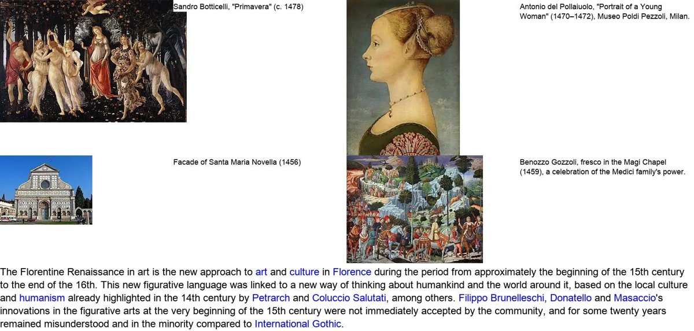
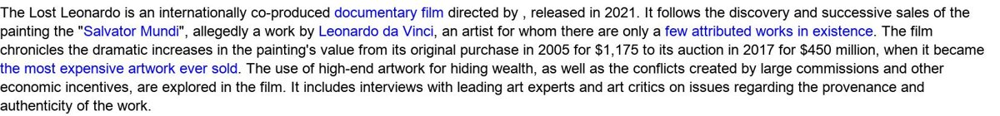

# Data

How to download and lay out every dataset used in the paper, and how to run the corresponding experiment. Commands are run from the repository root, after the setup of the main [README](../README.md) (environment, `.env`, Hugging Face resources and, for anything that uses ArtSeek, a running Qdrant server).

| Experiment (paper) | Datasets | Where they go | Code |
|---|---|---|---|
| [Retrieval](#retrieval-wikifragments) (Sec. 5.1, Tab. S2) | WikiFragments | Hugging Face cache | `artseek/method/retrieve/eval.py` |
| [Classification](#classification-artgraph) (Sec. 5.2, Tab. 1) | ArtGraph | `data/artgraph/` | `artseek/method/classify/` |
| [Artwork explanation](#artwork-explanation-artpedia-semart-v20-paintingform) (Sec. 5.3, Tab. 2, S3, S4) | ArtPedia, SemArt v2.0, PaintingForm | `data/external/` | `artseek/method/generate/test.py`, `eval.py` |
| [Question answering](#question-answering-and-human-evaluation) (Sec. 5.4, Tab. 3) | ArtPedia-VQA, AQUA, ArtQuest, LICNHeldOut, ArtCurate-AIC | `data/external/` | [`rebuttal`](https://github.com/cilabuniba/artseek/tree/rebuttal) branch |
| [Human evaluation](#question-answering-and-human-evaluation) (Sec. 5.5) | 14 rated paintings | included in the branch | [`rebuttal`](https://github.com/cilabuniba/artseek/tree/rebuttal) branch |

Final layout of `data/` (only the folders you need):

```
data/
├── artgraph/                  ArtGraph splits, WikiArt images, LICN precomputed embeddings
├── retrieval_eval/            retrieval-evaluation sample, questions, embeddings, results
└── external/
    ├── artpedia/              artpedia.json + images/<id>.jpg
    ├── explain_me/            annotations/{train,test}.json + images/  (SemArt v2.0)
    ├── painting_form/         formalanalysis_test_{gemini,gpt}.json + art_images_data/
    └── semart/images/         SemArt images for AQUA and ArtQuest (rebuttal branch)
```

---

## Retrieval (WikiFragments)

WikiFragments splits English Wikipedia into *multimodal fragments*: a paragraph together with every image that appears above it in the page. Each fragment is rendered as a single image (image-caption grid, then the text with its hyperlinks) and embedded with ColQwen2. ArtSeek uses the visual-arts subset, [`cilabuniba/wikifragments-visual-arts-embeds`](https://huggingface.co/datasets/cilabuniba/wikifragments-visual-arts-embeds), which the main README already downloads.

<p align="center">
  <br>
  <br>
  <em>Two rendered fragments: with images (top) and text-only (bottom).</em>
</p>

**Protocol.** 10,000 fragments are sampled: 5,000 with exactly one image and 5,000 with two or more. The first image is removed from each fragment, so the first half becomes text-only. Qwen2.5-VL-32B then writes a question about the removed image (always containing "this image") that the fragment answers, and the task is to retrieve the fragment from that image + question.

```bash
E="python -m artseek.method.retrieve.eval"
$E sample    --out data/retrieval_eval/sample                                   # CPU, reads the Hub dataset
$E questions --dataset data/retrieval_eval/sample --out data/retrieval_eval/qa  # GPU (transformers + FlashAttention)
$E embed     --dataset data/retrieval_eval/qa     --out data/retrieval_eval/qa_embeds   # GPU

# one Qdrant collection per store (QDRANT_URL)
$E store --dataset data/retrieval_eval/qa_embeds --kind full
$E store --dataset data/retrieval_eval/qa_embeds --kind pooled
$E store --dataset data/retrieval_eval/qa        --kind clip

# the five rows of Tab. S2 (metrics -> data/retrieval_eval/results/)
$E evaluate --dataset data/retrieval_eval/qa --store clip   --query clip
$E evaluate --dataset data/retrieval_eval/qa --store full   --query full
$E evaluate --dataset data/retrieval_eval/qa --store full   --query filtered
$E evaluate --dataset data/retrieval_eval/qa --store pooled --query full
$E evaluate --dataset data/retrieval_eval/qa --store pooled --query filtered
```

`filtered` keeps only the text tokens of the multimodal query (ArtSeek's encoding); `pooled` is the two-stage store (prefetch 100 on 9 pooled vectors per fragment, rerank on the full embeddings). The results also include the metrics of the first half of the sample (`half_*`, the text-only fragments). The sample depends on the row order of the dataset, so it can differ from ours.

<details>
<summary>Results in the paper (Tab. S2)</summary>

| Store | Query | NDCG@5 | R@1 | Avg time (cs) |
|---|---|---|---|---|
| CLIP | CLIP | 2.66 | 1.49 | **0.39** |
| Full (one-stage) | Full | 33.92 | 26.90 | 67.92 |
| Full (one-stage) | Filtered | **44.88** | **38.41** | 32.26 |
| Pooled (two-stage) | Full | 21.50 | 17.39 | 11.14 |
| Pooled (two-stage) | Filtered | 27.61 | 23.87 | 4.66 |
</details>

---

## Classification (ArtGraph)

[ArtGraph](https://zenodo.org/records/8172374) is a knowledge graph of 116,475 WikiArt artworks, each linked to one artist, genre and style and optionally to tags and media. LICN is trained on it with a 70/15/15 split stratified by style.

1. **Load the graph in Neo4j.** Install [Neo4j Community 4.4.47](https://neo4j.com/download-center/) with the [APOC plugin 4.4.0.24](https://github.com/neo4j-contrib/neo4j-apoc-procedures/releases/4.4.0.24), load the dump (`bin/neo4j-admin load --from=artgraph2.0.dump --database=neo4j --force`), start Neo4j, and set `NEO4J_URI`, `NEO4J_USERNAME` and `NEO4J_PASSWORD` in `.env`.
2. **Build the splits and download the images** (to `data/artgraph/`):
   ```bash
   python -m artseek.data.main make-artgraph-dataset                  # train/val/test.json
   python -m artseek.data.main define-valid-labels-artgraph-dataset   # labels with >= 100 artworks
   python -m artseek.data.main download-wikiart-images                # images/; re-run until all 116,475 are there
   ```
3. **Train and test** (the `tft` configuration is the one in the paper; `fff`, `ttf` and `ttt` are the weight-sharing ablations of Tab. S5):
   ```bash
   C=models/configs/classify/li_classification_network_tft.yaml
   python -m artseek.method.classify.train_li_classification_network precompute --config-path $C   # ColQwen2 embeddings, GPU
   accelerate launch -m artseek.method.classify.train_li_classification_network train --config-path $C
   accelerate launch -m artseek.method.classify.train_li_classification_network test  --config-path $C
   ```

The trained model used by ArtSeek is [`cilabuniba/artseek-licn`](https://huggingface.co/cilabuniba/artseek-licn); you do not need to retrain it to use the pipeline.

<details>
<summary>Results in the paper (Tab. 1, LICN)</summary>

| | Artist Top-1 | Artist Top-2 | Artist F1 | Genre Top-1 | Genre Top-2 | Genre F1 | Style Top-1 | Style Top-2 | Style F1 | Media F1 | Tags F1 |
|---|---|---|---|---|---|---|---|---|---|---|---|
| LICN | 71.75 | 80.59 | 65.01 | 78.54 | 89.34 | 73.25 | 69.80 | 84.23 | 66.65 | 59.49 | 39.59 |
</details>

---

## Artwork explanation (ArtPedia, SemArt v2.0, PaintingForm)

Zero-shot explanation of a painting, scored with captioning metrics. Each dataset has three configurations in `models/configs/generate/`, one per row of Tab. 2:

| Row in the paper | ArtPedia | SemArt v2.0 | PaintingForm |
|---|---|---|---|
| Qwen2.5-VL-32B | `artpedia_short_no_classify_no_retrieve` | `explain_me_short_no_classify_no_retrieve` | `painting_form_no_classify_no_retrieve` |
| ArtSeek (w/o class.) | `artpedia_short_no_classify` | `explain_me_short_no_classify` | `painting_form_no_classify` |
| ArtSeek | `artpedia_short` | `explain_me_short` | `painting_form` |

### ArtPedia

[ArtPedia](https://aimagelab.ing.unimore.it/imagelab/page.asp?IdPage=35) (Stefanini et al., 2019) has 2,930 paintings with visual and contextual sentences from Wikipedia. Download `artpedia.json` into `data/external/artpedia/`, then fetch the images, which are listed as Wikimedia URLs:

```bash
python scripts/download_artpedia_images.py            # test split -> data/external/artpedia/images/<id>.jpg
```

A few URLs no longer exist; paintings without an image are skipped.

### SemArt v2.0 (Explain Me the Painting)

SemArt v2.0 (Bai et al., 2021) annotates SemArt paintings with *content*, *form* and *context* sentences. The annotations are in [noagarcia/explain-paintings](https://github.com/noagarcia/explain-paintings), and the images are those of [SemArt](https://noagarcia.github.io/SemArt/), also mirrored on the Hub as [`leo20000306/SemArt`](https://huggingface.co/datasets/leo20000306/SemArt).

```bash
mkdir -p data/external/explain_me/annotations
git clone https://github.com/noagarcia/explain-paintings /tmp/explain-paintings
cp /tmp/explain-paintings/annotations/semart_topic_annotated_train.json data/external/explain_me/annotations/train.json
cp /tmp/explain-paintings/annotations/semart_topic_annotated_test.json  data/external/explain_me/annotations/test.json

hf download leo20000306/SemArt SemArt.zip --repo-type dataset --local-dir /tmp/semart
unzip -q /tmp/semart/SemArt.zip -d /tmp/semart
mv /tmp/semart/SemArt/Images data/external/explain_me/images
```

### PaintingForm

[PaintingForm](https://huggingface.co/datasets/steven16/Painting-Form) (Bin et al., 2024, GalleryGPT) has formal analyses written by Gemini and GPT. The images are a 10 GB archive.

```bash
hf download steven16/Painting-Form --repo-type dataset --local-dir data/external/painting_form
cd data/external/painting_form && unzip -q art_images_data.zip && cd -   # -> art_images_data/
```

### Run and score

```bash
for c in artpedia_short artpedia_short_no_classify artpedia_short_no_classify_no_retrieve; do
    python -m artseek.method.generate.test inference --config-path models/configs/generate/$c.yaml
    python -m artseek.method.generate.eval score     --config-path models/configs/generate/$c.yaml
done
```

`inference` writes `models/checkpoints/generate/<config>/preds.json` (resumable). `score` normalises the outputs as in the paper and writes `metrics.json` next to it. The paper uses one sentence per aspect for ArtPedia, all aspect sentences for SemArt v2.0, and the whole paragraph for PaintingForm. The scores are BLEU@1-4, METEOR, ROUGE-L, CIDEr and SPICE (pycocoevalcap, which needs **Java**). Use `--no-spice` for PaintingForm, as in the paper, where SPICE is too slow on long texts.

<details>
<summary>Results in the paper (Tab. 2, ArtSeek rows)</summary>

| Dataset | Model | B@1 | B@4 | METEOR | SPICE | ROUGE-L |
|---|---|---|---|---|---|---|
| ArtPedia | Qwen2.5-VL-32B | 36.57 | 3.93 | 9.46 | 6.81 | 21.22 |
| ArtPedia | ArtSeek (w/o class.) | 39.64 | 6.16 | 10.52 | 7.73 | 23.64 |
| ArtPedia | ArtSeek | 39.70 | 5.26 | 10.26 | 7.74 | 23.00 |
| SemArt v2.0 | Qwen2.5-VL-32B | 26.49 | 1.02 | 5.91 | 3.58 | 16.89 |
| SemArt v2.0 | ArtSeek (w/o class.) | 27.45 | 1.09 | 5.98 | 3.97 | 16.66 |
| SemArt v2.0 | ArtSeek | 28.15 | 1.30 | 6.21 | 4.12 | 17.28 |
| PaintingForm | Qwen2.5-VL-32B | 51.62 | 13.30 | 21.96 | — | 29.56 |
| PaintingForm | ArtSeek (w/o class.) | 54.35 | 14.01 | 20.69 | — | 29.48 |
| PaintingForm | ArtSeek | 52.93 | 13.90 | 21.18 | — | 29.30 |
</details>

---

## Question answering and human evaluation

The five QA benchmarks and the human study are on the [`rebuttal`](https://github.com/cilabuniba/artseek/tree/rebuttal) branch, in `rebuttal_experiments/`, with their own README (question files, runner, phi-4 judge, analysis). Their data goes into `data/external/`:

| Benchmark | Source | Images |
|---|---|---|
| ArtPedia-VQA | ours, questions in the branch | ArtPedia (above) |
| AQUA | [ArtVQA/AQUA](https://github.com/noagarcia/ArtVQA/tree/master/AQUA) (Garcia et al., 2020) | SemArt, extracted to `semart/images/` by the branch script |
| ArtQuest | [Zenodo 10453925](https://zenodo.org/records/10453925) (Bleidt et al., 2024), unzipped into `artquest/` | SemArt, extracted by the branch script |
| LICNHeldOut | ours (Wikidata), questions in the branch | downloaded by the branch script to `licn_heldout/images/` |
| ArtCurate-AIC | ours (Art Institute of Chicago, CC0), questions in the branch | downloaded by the branch script to `artcurate_aic/images/` |

<p align="center">
  <br>
  <em>ArtPedia-VQA example: the question alone names nothing to search for, so the image and the artwork card shape the query.</em>
</p>

<details>
<summary>Results in the paper (Tab. 3, mean correctness 0-2, judged by phi-4)</summary>

| Benchmark | n | KB coverage | Qwen2.5-VL-32B | ArtSeek (w/o class.) | ArtSeek | ArtSeek − backbone [95% CI] |
|---|---|---|---|---|---|---|
| ArtPedia-VQA | 651 | 85.8% | 0.535 | **0.774** | 0.722 | +0.186 [+0.119, +0.254] |
| LICNHeldOut | 762 | 53.3% | 1.010 | 1.086 | **1.197** | +0.186 [+0.114, +0.257] |
| AQUA | 652 | 10.4% | **0.920** | 0.910 | 0.896 | −0.025 [−0.095, +0.046] |
| ArtCurate-AIC | 1489 | 10.3% | **1.125** | 1.074 | 1.093 | −0.034 [−0.071, +0.003] |
| ArtQuest | 1200 | 8.9% | **0.937** | 0.828 | 0.914 | −0.023 [−0.076, +0.031] |
</details>

---

## Rebuilding WikiFragments

To build WikiFragments from a Wikipedia dump instead of downloading it, see [Rebuild the resources from scratch](../README.md#8-rebuild-the-resources-from-scratch) in the main README. The dump we used is `enwiki-latest-pages-articles.xml.bz2` of 2024-09-20, in `data/dumps/`.
